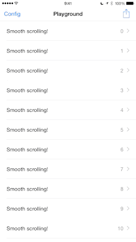
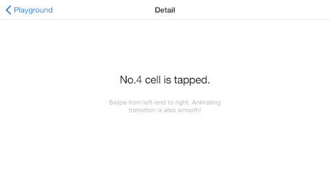
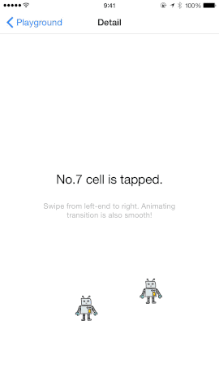
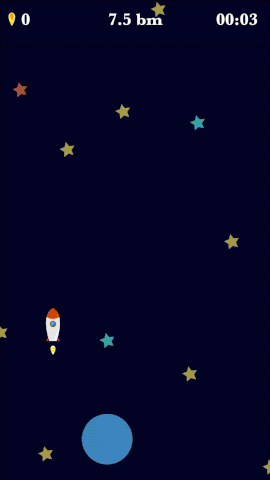

# 

[](http://cocoadocs.org/docsets/TouchVisualizer) [](http://cocoadocs.org/docsets/TouchVisualizer) [](http://cocoadocs.org/docsets/TouchVisualizer)
[](https://github.com/morizotter/TouchVisualizer)
[](https://circleci.com/gh/morizotter/TouchVisualizer/tree/master) [](https://gitter.im/morizotter/TouchVisualizer?utm_source=badge&utm_medium=badge&utm_campaign=pr-badge&utm_content=badge)

TouchVisualizer is a lightweight pure-Swift implementation for visualising `UITouch` events.

##Features
- Works with just **a single line** of code!
- Supports multiple fingers.
- Supports multiple `UIWindow`'s.
- Displays touch radius (finger size).
- Displays touch duration.
- Customise the finger-points image and colour.
- Supports iPhone and iPad in both portrait and landscape mode.

##How it looks
###Portrait:

###Landscape:

###Robots:

###In-app implementation:


It's fun!

##Runtime Requirements

- iOS8.1 or later
- Xcode 6.3

## Installation and Setup
**Note:** Embedded frameworks require a minimum deployment target of iOS 8.1.
**Information:** To use TouchVisualizer with a project targeting iOS 8.0 or lower, you must include the `TouchVisualizer.swift` source file directly in your project.

###CocoaPods

[CocoaPods](http://cocoapods.org) 0.36 adds supports for Swift and embedded frameworks. You can install it with the following command:

```bash
$ gem update
$ gem install cocoapods
$ pods --version
```

To install it, simply add the following lines to your Podfile:

```
source 'https://github.com/CocoaPods/Specs.git'
platform :ios, '8.1'

use_frameworks!

pod "TouchVisualizer", '~>1.2'
```

then, `pod install`

###Carthage

See [instruction here](https://github.com/Carthage/Carthage#installing-carthage).

Known Xcode 6.3.1 Problem: If you failed to install with errors. Try this command below on your risk. It seems Xcode bug - [SimVerifier returned error: Simulator verification failed. · Issue #424 · Carthage/Carthage](https://github.com/Carthage/Carthage/issues/424#issuecomment-95812898).

```
sudo chown :wheel /Library/Developer/CoreSimulator/Profiles/Runtimes/iOS\ *.simruntime/Contents/Resources/RuntimeRoot/usr/lib/dyld_sim
```

###Manual Installation

Copy files in the `Pod` directory into your project. That's all.

## Usage

To start using TouchVisualizer, write the following line wherever you want to start visualising:

```swift
import TouchVisualizer
``` 

Then invoke visualisation, by calling:

```swift
Visualizer.start()
```

and stop the presentation like this:

```swift
Visualizer.stop()
```

It is really simple, isn't it? 

##Customisation

TouchVisualizer also has the ability to customise your touch events. Here is an example of what can be customised:

```swift
var config = Configuration()
config.color = UIColor.redColor()
config.image = UIImage(named: "YOUR-IMAGE")
config.showsTimer = true
config.showsTouchRadius = true
config.showsLog = true
Visualizer.start(config)
```

###Configuration properties

|name|type|description|default|
|:----|:----|:----|:----|
| color | `UIColor` | Color of touch point and text. | default color |
| image | `UIImage` | Touch point image. If rendering mode is set to  `UIImageRenderingModeAlwaysTemplate`, the image is filled with color above. | circle image |
| defaultSize| `CGize` | Default size of touch point.| 60 x 60px |
| showsTimer| `Bool` | Shows touch duration. | false |
| showsTouchRadius | `Bool` | Shows touch radius by scalling touch point. It doesn't work on simulator. | false |
| showsLog | `Bool` | Shows log. | false |

##Documentation
###Peripheral

- [How to take an iOS screen movie](misc/take_a_movie.md)

###Presentation

- [TouchVisualizer Demo movie #potatotips // Speaker Deck](https://speakerdeck.com/morizotter/touchvisualizer-demo-movie-number-potatotips) @potatotips May 13 2015

##Contribution

I'm waiting for your contribution:)

##Licensing

TouchVisualizer is available under the MIT license. See the LICENSE file for more info.

##Alternative

There is similar *touch visualization* library: [COSTouchVisualizer](https://github.com/conopsys/COSTouchVisualizer). It seems support lower iOS versions and probably works neater. If TouchVisualizer doesn't fit for your project. Let's try this.
